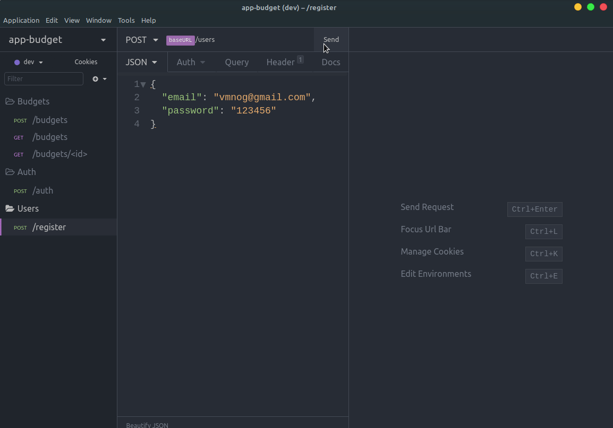

# app-budget-backend

An application API for technology project costs. To use the service, the customer must have an account registered in the system. Within the system, it will provide the necessary data to request a quote. At the end, the system will display the total value of the project. The client can also consult old budgets.



## How to install

**Create your docker container**

```
docker run --name app-budget -e POSTGRES_PASSWORD=docker -p 5432:5432 -d postgres
```

💭🔥 Don't forget to create the 'app-budget' database before running the project

**Clone the repository**

```
$ git clone  https://github.com/vmnog/app-budget-backend.git

$ cd app-budget-backend

$ yarn install

$ yarn typeorm migration:run

$ yarn dev:server
```

**You can download the `insomnia.json` file and import in your local insomnia to test the routes manually**

### Features

-   [x] User can register
-   [x] User can create a session JWT
-   [x] User can create budgets
-   [x] Budgets are calculated as demanded

### Techs used in this project

```
typescript
typeorm (using decorators)
express
jsonwebtoken
pg (postgres)
express
```
